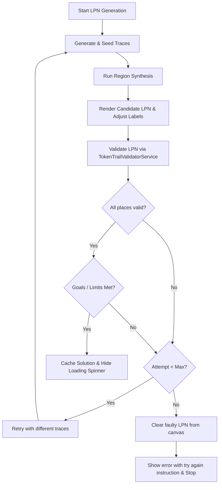

# Labeled Petri Net (LPN) Synthesis & Verification Guide

This document describes the design, implementation, and verification approach for **Labeled Petri Net (LPN) Synthesis** in the Token Trail tab, utilizing `ILPN-Components` region synthesis and linear programming (ILP) verification.

---

## 1. Core Synthesis Process

The generation of a candidate LPN from an original Petri net is executed in `TokenTrailLpnService.createLPNWithSynthesis`:

1. **Trace Generation**:
    - The play validation service calculates all possible execution paths (firing sequences/traces) from the original Petri net up to a difficulty-defined depth.
    - We extract valid firing sequences (which contain non-empty transition labels).

2. **Targeted Trace Seeding & Optimization**:
    - Instead of selecting a completely random subset of valid traces, the system seeds the trace set using active, capability-based goals for each difficulty level:
        - **Easy (Causal Sequence $A \rightarrow B$)**: Seeds the trace set with traces that contain the sequence $[A, B]$ (first checking for adjacency, then falling back to ordered $A$ followed by $B$) to guide region synthesis toward building causal sequence structures.
        - **Medium (Concurrency $A \parallel B$ & Loops)**: Prioritizes traces where concurrent transitions $A$ and $B$ appear interleaved in alternate orderings (e.g., $[..., A, ..., B, ...]$ and $[..., B, ..., A, ...]$) to force the GLPK solver to construct parallel AND-split structures. Also selects loop traces that demonstrate repeated occurrences of loop transitions.
        - **Hard (Conflict $Y$ vs $Z$ & Splits)**: Selects traces containing the conflict transitions $Y$ (and not $Z$) and $Z$ (and not $Y$) using a prefix-aligned strategy.
        - **Expert (Concurrency, Conflicts, & Loops)**: Seeds all relevant traces for concurrency, loops, and conflict combinations to ensure the synthesized net includes all structural constraints simultaneously if they are possible in the source net.
    - **Prefix-Aligned Conflict Trace Selection**: When selecting conflict traces for Hard or Expert mode, the system searches the trace space to find a pair of traces (`traceY` and `traceZ`) with the maximum possible common prefix before they branch into $Y$ and $Z$ (and ideally, exactly identical prefixes). This guides the region miner to merge the prefix paths and synthesize them branching from a shared preset place, directly representing a choice/conflict.
    - **Conflict Transition Non-Splitting**: During region synthesis, we prevent splitting (renaming) of conflict transitions ($Y$ and $Z$), ensuring they are synthesized as single transitions and can successfully share their preset Condition.
    - Remaining capacity up to the maximum trace limit is filled with other randomized traces.
    - We track the selection with a hash check (`_lastSelectedEntriesHash`) to ensure consecutive synthesis requests always yield varied nets.

3. **Mined Net Generation (Region Synthesis)**:
    - For the selected set of traces, we construct individual sequential Petri net graphs.
    - These nets are passed to `PetriNetRegionSynthesisService.synthesise` (using GLPK-based region mining) to construct a minimal Petri net that parses the language defined by these traces.
    - The mined net is visualised by translating its places and transitions into LPN Conditions and Events and calculating a clean layout using the Sugiyama hierarchy.

---

## 2. Validation-Driven Synthesis (The Retry Loop)

Sometimes, GLPK region synthesis generalizes the trace language excessively, yielding an LPN that contains invalid behaviors, violates the strict **token trail semantics** of the original Petri net, or fails to satisfy the active semantic/behavioral goals of the selected difficulty level.

To guarantee that any synthesized LPN presented to the user is 100% solvable and compliant with active goals, we enforce a **Direct Check Verification Loop** during the generation phase:

### 2.1 The Retry Mechanism

- Inside `attemptSynthesis()`, once the candidate LPN is rendered, we immediately invoke `TokenTrailValidatorService.validate(ilpnSource, ilpnSpec)`.
- If the ILP solver returns `allValid === true`, we verify that the candidate satisfies all active difficulty goals:
    - We evaluate the active behavioral goals (e.g. Causal Sequence, Concurrency, Conflict, Loop, etc.) on the candidate LPN. Note that the overall token trail validity is checked implicitly by the ILP solver.
- If the candidate is semantically valid AND all active goals are met, we check if **Expert Mode** is active:
    - **LPN Candidate Minimization**: In Expert Mode, the initial candidate LPN synthesized by the region miner might contain redundant places/conditions. To produce the most minimal net, we perform a greedy pruning pass. We attempt to remove each Condition (and its associated arcs/disconnected events) one by one and re-validate. If the net remains valid and all goals are still met, we permanently prune the condition.
- If either check fails, we increment the attempt counter, log the warning, and trigger a new attempt with a different trace selection.
- The retry loop is capped at a maximum of **50 attempts** in Construction Mode (and **15 attempts** in Puzzle Mode) to prevent infinite loops.
- **Fail-Safe Cleanup**: If the maximum number of attempts is reached, or if an asynchronous error occurs, we call `this.stateService.clear()`. This completely wipes any invalid or partially constructed LPN from the canvas so the user is never presented with a faulty model.

---

## 3. Caching & Instant Solution Resolution

To optimize performance and avoid redundant NP-hard ILP computations, we implement a caching mechanism across tab interactions:

### 3.1 Solution Cache (`TokenTrailStateService`)

- On successful synthesis, the solved token trails (mapping: `petriNetPlaceId -> conditionId -> tokenCount`) returned by the validator are saved in `this.stateService.solutionCache`.
- When the user toggles the **Show Solution** button (`toggleSolution()` in `token-trail-draw-display.ts`):
    - **Cache Hit**: If `solutionCache` is present, the component instantly applies the markings to the canvas and toggles the solution view, completely bypassing the solver.
    - **Cache Miss**: If `solutionCache` is null (e.g. in construction mode where elements are manually laid out), it falls back to querying the `TokenTrailValidatorService` asynchronously.

### 3.2 Cache Invalidation

The solution cache is strictly tied to the visual structure of the net. To prevent showing out-of-date solutions on a modified LPN, any structural updates automatically invalidate the cache:

- Creating or deleting a Condition or Event (`addDrawnElement`, `removeDrawnElement`) sets `solutionCache = null`.
- Creating, deleting, or altering a Connection weight (`addConnection`, `removeConnection`, `updateConnections`) sets `solutionCache = null`.
- Finalizing or unmerging condition groups (`updateDrawnElements`) sets `solutionCache = null`.
- Clearing the drawing completely sets `solutionCache = null`.

---

## 4. Tab-Switch Preservation & Petri Net Structural Signatures

Since `TokenTrailDrawDisplayComponent` is destroyed when the user switches tabs and re-created when they return, subscribing directly to `sourceNet$` in `ngOnInit` would ordinarily trigger an immediate LPN regeneration on return, causing the user to lose their current puzzle progress.

To solve this, we track the exact structure of the Petri net last used to generate the LPN:

### 4.1 Structural Signature Generation (`TokenTrailLpnService`)

We compute a unique structural signature string for the Petri Net via `getNetSignature(net: Diagram)`:

- Maps all nodes (`id` + `label`) sorted alphabetically.
- Maps all **initial start place markings** (`placeId` + `tokenCount` from `net.startMarking`) sorted alphabetically.
- Maps all arcs (`source` + `target` + `weight`) sorted alphabetically.
- Joins them as a single string: `nodes_signature::markings_signature::arcs_signature`.

### 4.2 Preservation Check

Upon successful synthesis, the signature is stored in `this.stateService.lastSynthesizedNetSignature`.
When subscribing to `sourceNet$` on tab re-entry:

- We check if an LPN is already drawn (`drawnElements().length > 0`).
- We check if `getNetSignature(net)` matches `lastSynthesizedNetSignature`.
- If both conditions are met, we **bypass synthesis completely**, retaining the user's current elements, connections, and progress intact.

---

## 5. LPN Serialization & Exporting

To allow users to save their Labeled Petri Nets, we support exporting the LPN layout to both standard **JSON** and **PNML (XML)** formats.

### 5.1 Extension of `SerializationService`

- We introduced `serializeLpn(drawnElements: LabeledNetNode[], connections: LabeledNetEdge[], format: SUPPORTED_FORMAT): string` inside `SerializationService`.
- It maps the current visual LPN structure into standard `DiagramPlace`, `DiagramTransition`, and `DiagramArc` classes, and then wraps them in a standard `Diagram` class for serialization.

### 5.2 Export/Import Toolbar Actions

- Dropdown menu allows exporting LPN to JSON or PNML format.
- Drag-and-drop file loading parses JSON or PNML back to LPN canvas, restoring condition positions, baseNames, and trail markings.

---

## 6. LPN Condition Naming & Dynamic Labeling

### 6.1 Condition ID Naming Scheme (`c1` to `cx`)

- All LPN conditions are assigned IDs matching the prefix pattern `c1`, `c2`, ..., `cx`.

### 6.2 Dynamic Visual Labeling

LPN conditions dynamically adjust their visual labels directly on the canvas to represent their active token trail markings:

- **Default State**: Visual label falls back to its base name (e.g., `c1`).
- **Dynamic Marking State**: Displays the sum of the original Petri net place IDs (with multiplicity) that have a token here (e.g., `p1 + p5` or `p2 + 2*p3`).
- Full labels are shown on hover via standard browser tooltips.
