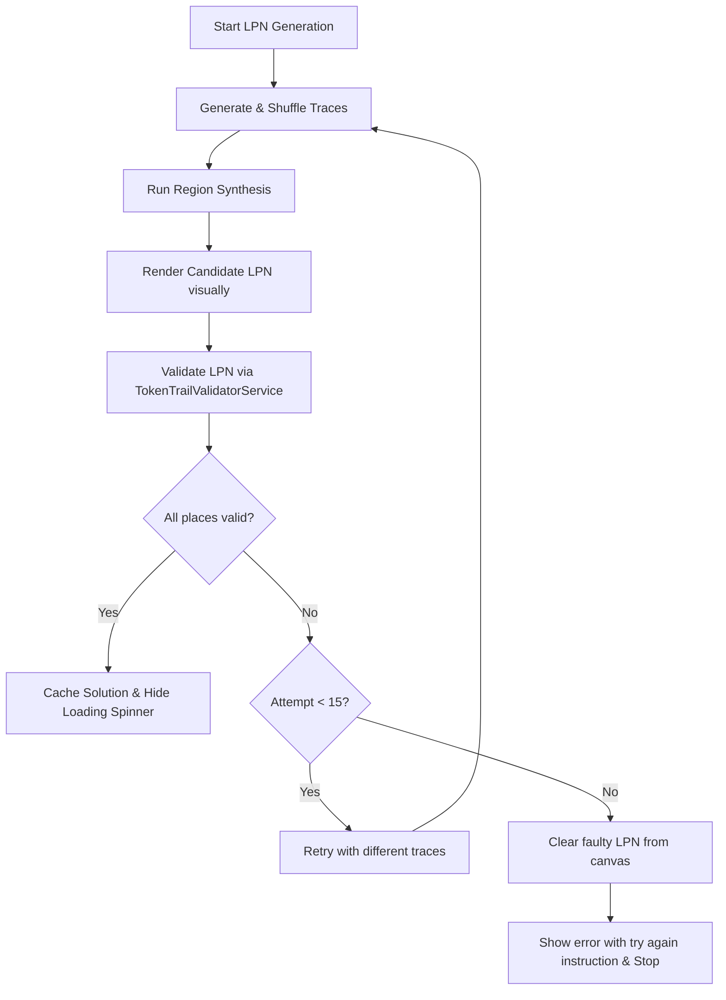

# Labeled Petri Net (LPN) Synthesis & Verification Guide

This document describes the design, implementation, and verification approach for **Labeled Petri Net (LPN) Synthesis** in the Token Trail tab, utilizing `ILPN-Components` region synthesis and linear programming (ILP) verification.

---

## 1. Core Synthesis Process

The generation of a candidate LPN from an original Petri net is executed in `TokenTrailLpnService.createLPNWithSynthesis`:

1. **Trace Generation**:
    - The play validation service calculates all possible execution paths (firing sequences/traces) from the original Petri net up to a difficulty-defined depth.
    - We extract valid firing sequences (which contain non-empty transition labels).

2. **Randomized Trace Selection**:
    - Depending on the difficulty level (Easy, Medium, Hard), a randomized subset of these valid traces is chosen.
    - We shuffle the candidates and select a subset matching the configuration's maximum trace size.
    - We track the selection with a hash check (`_lastSelectedEntriesHash`) to ensure consecutive synthesis requests always yield varied nets.

3. **Mined Net Generation (Region Synthesis)**:
    - For the selected set of traces, we construct individual sequential Petri net graphs.
    - These nets are passed to `PetriNetRegionSynthesisService.synthesise` (using GLPK-based region mining) to construct a minimal Petri net that parses the language defined by these traces.
    - The mined net is visualised by translating its places and transitions into LPN Conditions and Events and calculating a clean layout using the Sugiyama hierarchy.

---

## 2. Validation-Driven Synthesis (The Retry Loop)

Sometimes, GLPK region synthesis generalizes the trace language excessively, yielding an LPN that contains invalid behaviors or violates the strict **token trail semantics** of the original Petri net (meaning, some places in the original net cannot mathematically find a valid token trail on the new LPN).

To guarantee that any synthesized LPN presented to the user is 100% solvable, we enforce a **Direct Check Verification Loop** during the generation phase:

### 2.1 The Retry Mechanism

- Inside `attemptSynthesis()`, once the candidate LPN is rendered, we immediately invoke `TokenTrailValidatorService.validate(ilpnSource, ilpnSpec)`.
- If the ILP solver returns `allValid === true`, the candidate LPN is accepted.
- If `allValid === false`, we log the failure, clear the state, increment the attempt counter, and recursively trigger a new attempt with a different trace selection.
- The retry loop is capped at a maximum of **15 attempts** to prevent infinite loops in edge/impossible cases.
- **Fail-Safe Cleanup**: If the maximum number of 15 attempts is reached, or if an asynchronous error occurs during region synthesis or validator solving, we call `this.stateService.clear()`. This completely wipes any invalid or partially constructed LPN from the canvas so the user is never presented with a faulty model. A localized toaster message is then displayed asking the user to try again.

---

## 3. Caching & Instant Solution Resolution

To optimize performance and avoid redundant NP-hard ILP computations, we implement a caching mechanism across tab interactions:

### 3.1 Solution Cache (`TokenTrailStateService`)

- On successful synthesis, the solved token trails (mapping: `petriNetPlaceId -> conditionId -> tokenCount`) returned by the validator are saved in `this.stateService.solutionCache`.
- When the user toggles the **Show Solution** button (`toggleSolution()` in `token-trail-draw-display.ts`):
    - **Cache Hit**: If `solutionCache` is present, the component instantly applies the markings to the canvas and toggles the solution view, completely bypassing the solver.
    - **Cache Miss**: If `solutionCache` is null (e.g. in construction mode where elements are manually laid out), it falls back to querying the `TokenTrailValidatorService` asynchronously.

### 3.2 Cache Invalidation

The solution cache is strictly tied to the visual structure of the net. To prevent showing out-of-date solutions on a modified LPN, any structural updates automatically invalidate the cache:

- Creating or deleting a Condition or Event (`addDrawnElement`, `removeDrawnElement`) sets `solutionCache = null`.
- Creating, deleting, or altering a Connection weight (`addConnection`, `removeConnection`, `updateConnections`) sets `solutionCache = null`.
- Finalizing or unmerging condition groups (`updateDrawnElements`) sets `solutionCache = null`.
- Clearing the drawing completely sets `solutionCache = null`.

> **Note**: User updates to puzzle token counts (which only alter their current workspace state) do not change the underlying graph topology and thus **do not** invalidate the structural cache.

---

## 4. Tab-Switch Preservation & Petri Net Structural Signatures

Since `TokenTrailDrawDisplayComponent` is destroyed when the user switches tabs and re-created when they return, subscribing directly to `sourceNet$` in `ngOnInit` would ordinarily trigger an immediate LPN regeneration on return, causing the user to lose their current puzzle progress.

To solve this, we track the exact structure of the Petri net last used to generate the LPN:

### 4.1 Structural Signature Generation (`TokenTrailLpnService`)

We compute a unique structural signature string for the Petri Net via `getNetSignature(net: Diagram)`:

- Maps all nodes (`id` + `label`) sorted alphabetically.
- Maps all **initial start place markings** (`placeId` + `tokenCount` from `net.startMarking`) sorted alphabetically. This ensures that LPN regeneration is only triggered by permanent marking changes configured in the **Draw** tab. Temporary or tab-specific token changes resulting from active firing simulations in the **Play**, **Reachability Graph**, or **Process Net** tabs do not affect `startMarking` and will not trigger recreation.
- Maps all arcs (`source` + `target` + `weight`) sorted alphabetically.
- Joins them as a single string: `nodes_signature::markings_signature::arcs_signature`.

### 4.2 Preservation Check

Upon successful synthesis, the signature is stored in `this.stateService.lastSynthesizedNetSignature`.
When subscribing to `sourceNet$` on tab re-entry:

- We check if an LPN is already drawn (`drawnElements().length > 0`).
- We check if `getNetSignature(net)` matches `lastSynthesizedNetSignature`.
- If both conditions are met, we **bypass synthesis completely**, retaining the user's current elements, connections, and progress intact.
- If the Petri net structure was modified in another tab, the signature check fails, and we regenerate the LPN to align it with the new model.

To prevent intrusive or confusing toaster popups, `TokenTrailLpnService` injects `TabStateService`. All asynchronous success, warning, or error toasters inside `attemptSynthesis` are wrapped with a check verifying that `this.tabStateService.currentTab() === Tab.TOKEN_TRAIL`. If the user is on a different tab when the asynchronous process resolves, the toaster alerts are suppressed.

---

## 5. LPN Serialization & Exporting

To allow users to save their synthesized or custom-built Labeled Petri Nets, we support exporting the LPN layout to both standard **JSON** and **PNML (XML)** formats:

### 5.1 Extension of `SerializationService`

- We introduced `serializeLpn(drawnElements: LabeledNetNode[], connections: LabeledNetEdge[], format: SUPPORTED_FORMAT): string` inside `SerializationService`.
- It dynamically maps the current visual LPN structure (Conditions, LabeledEvents, and Connections) into standard `DiagramPlace`, `DiagramTransition`, and `DiagramArc` classes, and then wraps them in a standard `Diagram` class.
- The resulting `Diagram` object is directly serialized using the existing and thoroughly tested JSON/PNML serialization engines (`serializeJson` and `_serializePnml`), ensuring zero code duplication.

### 5.2 Export Toolbar Actions

- A new **Export LPN** (`file_download`) dropdown menu action is integrated into the Token Trail drawing toolbar.
- When clicked, it exposes two sub-menu items:
    - **Export as JSON** (`code` icon)
    - **Export as PNML** (`article` icon)
- Both actions trigger `exportLpn(format)` in the drawing display component, which serializes the current network and dynamically generates a standard browser file download (`lpn.json` or `lpn.pnml`).

### 5.3 Import & Drag-and-Drop Loading

- Users can import LPN files (JSON or PNML format) by dragging and dropping them directly onto the LPN drawing canvas.
- When a file drop is detected:
    1. We read the file contents using `FileReader` and parse the raw string into a structured `Diagram` using `ParserService.parse()`.
    2. We pass the parsed `Diagram` to `TokenTrailLpnService.loadLpnFromDiagram()`.
    3. The service maps the diagram's places back to LPN conditions (preserving layout coordinates, token counts, and **recovering their `trailMarkings`** by parsing place labels like `p1 + p5`), transitions to LPN events, and arcs to LPN connections.

---

## 6. LPN Condition Naming & Dynamic Labeling

To ensure consistency across both synthesized and user-constructed Labeled Petri Nets, condition identifiers and visual labels follow strict guidelines:

### 6.1 Condition ID Naming Scheme (`c1` to `cx`)

- All LPN conditions (places on the right-hand canvas) are assigned IDs matching the prefix pattern `c1`, `c2`, ..., `cx`.
- **Synthesis Mode**: When generating the mined LPN, the region synthesis output places are mapped directly to condition nodes with IDs using the standard sequential `generateConditionName()` counter.
- **Construction / Drag & Drop Mode**: When dragging elements from the original Petri net (left canvas) to the LPN canvas (right canvas) or creating them from the toolbox, we dynamically generate a fresh ID using `generateConditionName()`. This avoids generic or confusing IDs like `drawn-p1-1` and ensures all LPN conditions consistently conform to the `c1` to `cx` series.

### 6.2 Dynamic Visual Labeling

LPN conditions dynamically adjust their visual labels directly on the canvas to represent their active token trail markings:

- **Default State**: When a condition has no token trails assigned (empty `trailMarkings`), the visual label falls back to its base name (e.g., `c1`).
- **Dynamic Marking State**: When a condition holds tokens for one or more Petri Net places (either because the user manually clicked in puzzle mode, clicked "Show Solution", or dragged/merged places in construction mode), the visual label dynamically displays the sum of the original Petri net place IDs (with multiplicity) that have a token here (e.g., `p1 + p5` or `p2 + 2*p3`).
- **Unified Presentation**: The visual label is rendered dynamically on the canvas in both puzzle and construction modes, ensuring the active token trail and LPN state are always visible and interactive for the user. Full (untruncated) labels are shown on hover via standard browser tooltips.
